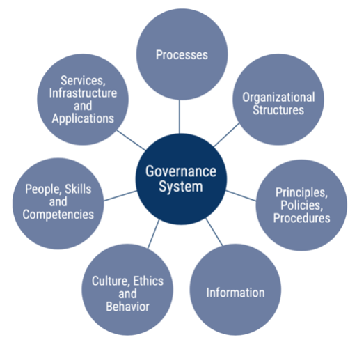
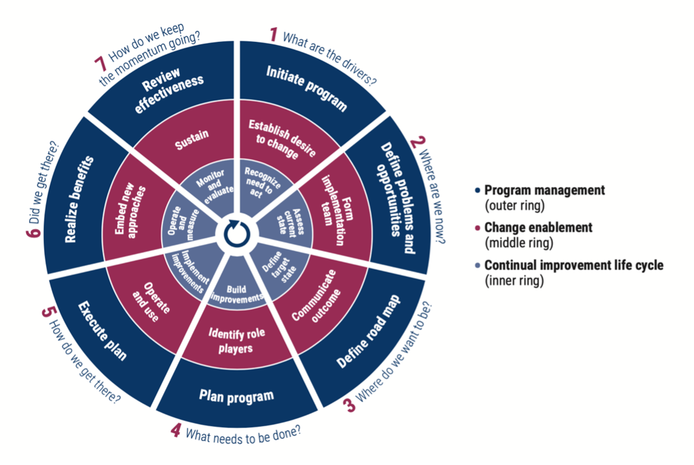

# Cloud Governance en COBIT 2019

COBIT 2019 is een framework voor het bestuur en beheer van bedrijfsinformatie en -technologie van de hele organisatie. COBIT heeft betrekking tot alle technologie en informatieverwerking die een onderneming gebruikt om haar doelen te behalen, ongeacht waar dit plaatsvindt. Dit beperkt zich dus niet tot de IT-afdeling van een organisatie. COBIT 2019 is gebaseerd op meer dan 25 jaar ontwikkeling in Governance en bevat onderdelen uit COBIT 5, de voorloper van COBIT 2019.
	
COBIT 2019 maakt een duidelijk onderscheid tussen Governance en Management. Governance zorgt er onder anderen voor dat de behoeften van stakeholders afgewogen, geëvalueerd en gebalanceerd worden op basis van de bedrijfsdoelstellingen. Management is verantwoordelijk voor het plannen, bouwen uitvoeren en monitoren van activiteiten die in overeenstemming zijn met de richting die door Governance ingeslagen is.

Om goed te begrijpen wat COBIT 2019, is het tevens belangrijk om te begrijpen wat het niet is. Veel voorkomende misverstanden van COBIT 2019 zijn namelijk:
-	Het is geen framework om bedrijfsprocessen mee te organiseren.
-	Het is geen technisch framework waarmee alle technologie binnen een organisatie mee beheerd kan worden.
-	Het is geen IT-strategie of IT-architectuur.

(ISACA, 2019, p. 13)

COBIT 2019 is ook een heleboel wel, de kracht van COBIT 2019 is wat ons betreft dat het framework ontzettend uitgebreid is waardoor er veel structuur op basis van één framework binnen een organisatie gecreëerd kan worden. Daarnaast zijn governance- en managementdoelstellingen to-the-point, concreet en meetbaar beschreven waardoor het een stuk eenvoudiger is om het framework te implementere. Ook beschrijft COBIT 2019 expliciet welke activiteiten er benodigd zijn om een bepaald Governance of Managementdoel te behalen. Een nadeel van COBIT 2019 is wat ons betreft echter dat de omvang simpelweg enorm is waardoor het veel tijd kost om alle informatie tot je te nemen. COBIT 2019 bestaat namelijk uit 4 guides met in totaal bijna 600 pagina’s aan informatie. Bij het implementeren van COBIT 2019 is het daarom erg belangrijk om de verwachtingen van stakeholders goed te managen.

COBIT 2019 onderkent de volgende governance-onderdelen (ISACA, 2018c, pp. 12–13):
**Processen** beschrijven een georganiseerde reeks van activiteiten om bepaalde doelstellingen en outputs te bereiken. **Organisatiestructuren** worden altijd gebruikt voor het maken van beslissingen. **Principles, policies en frameworks** zorgen voor de vertaalslag van het gewenste gedrag naar begeleiding voor dag-tot-dag management. **Informatie** bevat alle gegevens die door de organisatie gebruikt worden om haar doelen te behalen. **Cultuur, ethiek en gedrag** hebben invloed op het succesvol implementeren van governance en zijn daarom ook onderdeel van het framework. Goede **Mensen, skills en competenties** zijn veriest voor het maken van de juiste beslissingen en het correct uitvoeren van alle activiteiten. **Diensten, infrastructuur en applicaties** bevat de ondersteunende infrastructuur, technologie en applicaties die de Enterprise nodig heeft voor het governance systeem.



COBIT 2019 bestaat uit 40 governance- en managementdoelstellingen. COBIT 2019 groepeert de managementdoelstellingen in 4 domeinen, maar alleen het éérste domein is relevant voor dit rapport, namelijk: “Align, Plan and Organize (APO)”. Alle Governance doelstellingen van COBIT 2029 zijn gegroepeerd in één domein: “Evaluate, Direct and Monitor (EDM)”.
Volgens COBIT 2019 hebben de volgende managementdoelstellingen een relatie met Cloud:

#### APO09—Managed Service Agreements
Stem informatie en technologie producten, diensten en SLA’s af op de behoeften en verwachtingen van de organisatie. Het doel is om ervoor te zorgen dat producten, diensten en SLA’s afgestemd worden op de huidige en toekomstige behoeften van de organisatie (ISACA, 2018a, p. 113).

#### APO10—Managed Vendors
Beheer informatie en technologie die gerelateerd is aan producten en diensten die afgenomen worden van derde partijen. Dit omvat ook het zoeken en selecteren van vendoren, het beheer van contracten en het monitoren van de prestaties die geleverd worden door deze vendoren. Het doel van dit proces is om de risico’s van slecht presterende vendoren te minimaliseren en zorgen voor concurrerende prijzen (ISACA, 2018a, p. 119).
Daarnaast heeft de volgende governancedoelstelling van COBIT 2019 een relatie met Cloud:

#### MEA01—Managed Performance and Conformance Monitoring
Verzamel, valideer en evalueer bedrijfsdoelen. Controleer of processen en practices presteren ten opzichte van overeengekomen prestatie- en conformiteitsdoelen. Zorg voor een systematische en tijdige rapportage (ISACA, 2018a, p. 273).


Om de bovengenoemde en andere governance- en managementdoelstellingen te implementeren worden de onderstaande 7 fases doorlopen. Zodra alle fases zijn uitgevoerd kunnen er nieuwe doelen en eisen geformuleerd worden. Vervolgens wordt er een nieuwe cycli in gang gezet (ISACA, 2018c, pp. 24–25).
 
 
(ISACA, 2018c, fig. 3.4)

***1.	Fase 1:*** Wat zijn de drivers?
Identificeer welke ‘drivers’ er voor de wijziging zijn en beschrijf dit in een business case. De driver mag gebaseerd zijn op interne of externe gebeurtenissen zoals trends in de industrie, zoals Cloud.

***2.	Fase 2: Waar zijn we nu?***
Breng informatie & technologie doelen in lijn met Enterprise strategieën en risico’s. Prioriteer de belangrijkste Enterprise doelen.

***3.	Fase 3: Waar willen we naartoe werken?***
Beschrijft een doel voor de verbetering gevolgd door een gap-analyze om de potentiële oplossingen te identificeren. 

***4.	Fase 4: Wat moet er gebeuren?***
Beschrijft hoe praktische oplossingen kunnen worden gepland door projecten te definiëren.

***5.	Fase 5: Hoe komen we daar?***
Voorziet in de implementatie van de voorgestelde oplossingen door de maatregelen in de praktijk te brengen. Richt daarnaast een monitoringsysteem in zodat de prestaties kunnen worden gemeten.

***6.	Fase 6: Zijn we er?***
Deze fase richt zich tot het overdragen van de verbeterde governance naar de normale bedrijfsvoering. Daarnaast focust deze fase zich op het monitoren van de verbeteringen middels performance metrics en verwachte voordelen.

***7.	Fase 7: Hoe behouden we het momentum?***
Deze fase beoordeelt het algehele succes van het initiatief, identificeert verdere governance- of managementvereisten en versterkt de behoefte aan voortdurende verbetering.
#### Bronnen
```
ISACA. (2018a). COBIT® 2019: Governance and Management Objectives. In COBIT® 2019 Framework.
ISACA. (2018b). COBIT® 2019 Designing an Information and Technology Governance Solution.
ISACA. (2018c). COBIT® 2019 Implementation Guide: Implementing and Optimizing an Information and Technology Governance Solution.
ISACA. (2019). COBIT 2019 Framework Introduction and methodology.
```
